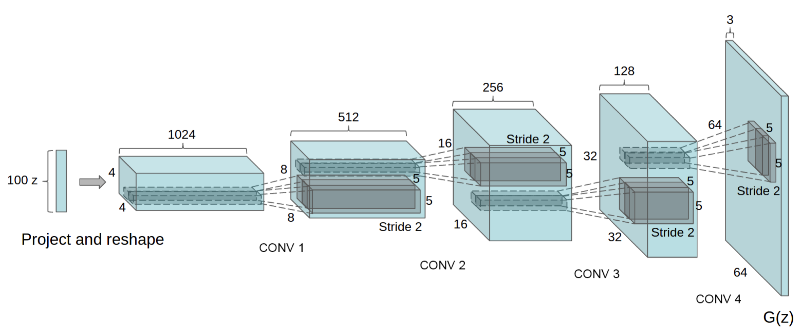

DCGAN for CelebA in PyTorch
===========================

This repository contains an example implementation of a DCGAN
architecture written in PyTroch. For the demonstration, I've
used [CelebA dataset](http://mmlab.ie.cuhk.edu.hk/projects/CelebA.html).

## How to run it?

Training and visualization should work without any modifications
and default arguments will reproduce my results. Hyperparameters
were taken from the papers but can be tuned by passing arguments
to below scripts.

**Instruction:**

```bash
$ virtualenv -p python3.7 venv
$ . venv/bin/activate
(venv) $ pip install -r requirements.txt
(venv) $ python train.py
(venv) $ python visualize.py --checkpoint={YOUR_CHECKPOINT}
```

**Help:**

```bash
(venv) $ python train.py -h
(venv) $ python visualize.py -h
```

## Results

**Visualization of example images**


**Visualization of latent space**


## Architecture



## Resources

* [[arXiv](https://arxiv.org/abs/1406.2661)] __Ian J. Goodfellow,
  Jean Pouget-Abadie, Mehdi Mirza, Bing Xu, David Warde-Farley,
  Sherjil Ozair, Aaron Courville, Yoshua Bengio__
  "Generative Adversarial Networks"

* [[arXiv](https://arxiv.org/abs/1511.06434)] __Alec Radford, Luke Metz,
  Soumith Chintala__ "Unsupervised Representation Learning with Deep
  Convolutional Generative Adversarial Networks"
